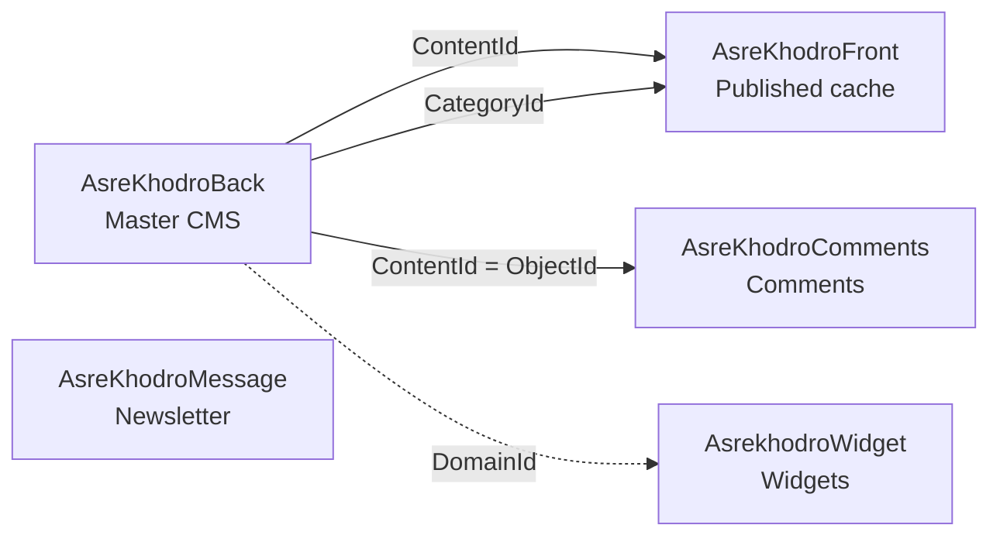

# Cross-database relationships

How the five AsreKhodro databases connect. There are **no cross-database foreign keys** in SQL Server — links are by shared IDs in application code.

## Architecture overview

```
AsreKhodroBack (master CMS)
    │ ContentId, CategoryId, FileId, DomainId
    ├──► AsreKhodroFront (published site cache)
    ├──► AsreKhodroComments (ObjectId = ContentId)
    └──► AsrekhodroWidget (DomainId only)

AsreKhodroMessage (standalone: contacts & newsletter)
```

## Database summary

| Database | Tables | Total rows | Role |
|----------|--------|------------|------|
| [AsreKhodroBack](./AsreKhodroBack/README.md) | 56 | 4,321,045 | Master CMS (admin backend) |
| [AsreKhodroComments](./AsreKhodroComments/README.md) | 7 | 27,260 | User comments on site content |
| [AsreKhodroFront](./AsreKhodroFront/README.md) | 21 | 311,173,742 | Published website cache (read-optimized) |
| [AsreKhodroMessage](./AsreKhodroMessage/README.md) | 9 | 8,685 | Contacts, newsletter, and internal messaging |
| [AsrekhodroWidget](./AsrekhodroWidget/README.md) | 23 | 4,615 | Sidebar / widget content module |

## Verified cross-database links

| From | To | Join | Notes | Verified |
|------|----|------|-------|----------|
| AsreKhodroBack.ContentCommonInfo.ContentId | AsreKhodroFront.SingleContent.ContentId | `ContentId = ContentId` | Front publishes a subset of Back content (197,643 / 199,653 rows matched in sample). | 197643 matching rows |
| AsreKhodroBack.Categories.Id | AsreKhodroFront.Categories.Id | `Id = Id` | Category tree copied to Front (99 categories, IDs match). | 99 matching rows |
| AsreKhodroBack.ContentCommonInfo.ContentId | AsreKhodroComments.CommentCommonInfo.ObjectId | `ContentId = ObjectId` | Comments attach to articles via ObjectId = ContentId. | 6807 / 6808 comments matched |
| AsreKhodroBack.ContentCategories.ContentId | AsreKhodroFront.ContentCategories.ContentId | `ContentId = ContentId` | Post–category links replicated to Front (row counts differ slightly). | logical copy |
| AsreKhodroBack.ContentFiles.ContentId | AsreKhodroFront.ContentFiles.ContentId | `ContentId = ContentId` | Media attachments replicated to Front. | logical copy |
| AsreKhodroBack.KeywordsContent.ContentId | AsreKhodroFront.KeywordsContent.ContentId | `ContentId = ContentId` | Keywords/tags replicated to Front. | logical copy |
| AsreKhodroBack.Domain.Id | AsrekhodroWidget.FileInitialize.DomainId | `Id = DomainId` | Widget files scoped to the same multi-language domains as Back. | DomainId=1 in Widget |

## WordPress migration order

1. **AsreKhodroBack** — posts, categories, media, users (source of truth)
2. **AsreKhodroFront** — validate published subset; skip `Main*` caches and `Hits`
3. **AsreKhodroComments** — map `ObjectId` → WordPress post ID
4. **AsrekhodroWidget** — widgets/blocks (separate file IDs)
5. **AsreKhodroMessage** — newsletter contacts (optional plugin)

## Mermaid diagram



---

[← Back to all databases](./README.md)
